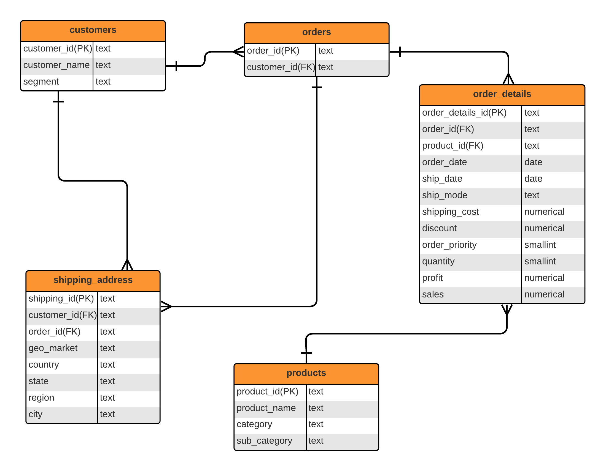

# Global Superstore Data Analysis

## Table of Contents
- [Introduction](#introduction)
- [Project Structure](#project-structure)
- [ER Diagram](#er-diagram)
- [Database Schema](#database-schema)
- [Queries](#queries)
- [Usage](#usage)
- [Contributing](#contributing)
- [License](#license)

## Introduction
This project involves analyzing a dataset from a hypothetical global superstore using PostgreSQL. The dataset includes various attributes related to orders, customers, products, and shipping details. The analysis aims to uncover insights such as the best-performing products, customer segment distributions, and sales trends. For convenience sake, some attributes have been removed from the dataset. 
Please find the dataset here, with more information on the attributes involved --> [Kaggle Global Superstore Dataset](https://www.kaggle.com/datasets/fatihilhan/global-superstore-dataset)

Prerequisites for this project will include knowing postgreSQL and knowing how to utilise an editor like pgAdmin4.

## Project Structure
The repository is structured as follows:
- **README.md**: This file containing project overview and instructions.
- **Global_Superstore_ER_Diagram.png**: An image depicting the Entity-Relationship Diagram of the database.
- **schema.sql**: SQL file containing the schema definitions and data insertion statements for the database.
- **queries.sql**: SQL file with queries for data cleaning and exploration.
- **queries_answers.sql**: SQL file containing the answers for the queries in `queries.sql`.

## ER Diagram

[Download ER Diagram Image](Global_Superstore_ER_Diagram.png)

## Database Schema
The `schema.sql` file creates the database and inserts data into the tables. It includes definitions for the following tables:
- **staging_superstore**: A staging table we use to initially insert from the unnormalized dataset.
- **customers**: Contains customer details including customer ID, name, and segment.
- **orders**: Records details of orders including order ID and customer ID.
- **order_details**: Contains detailed information of each order including product ID, order date, and sales amount.
- **products**: Lists products available in the store with product ID and category.
- **shipping_addresses**: Stores shipping address details including country, state, and city.

## Queries
The `queries.sql` file includes various SQL queries used for cleaning data and exploring the dataset. Key queries include:

## Usage
To use this project, follow these steps:
1. Clone the repository: `git clone https://github.com/yourusername/globalsuperstore-analysis.git`
2. Set up the database using the `schema.sql` file:
   ```bash
   psql -U yourusername -d yourdatabase -f schema.sql

## Contributing
Contributions are welcome! Please open an issue or submit a pull request for any improvements or new features.

## License
This project is licensed under the MIT License. See the [license_file.txt](license_file.txt) file for details.

## Author
This project is created and maintained by Matthew Walton.


